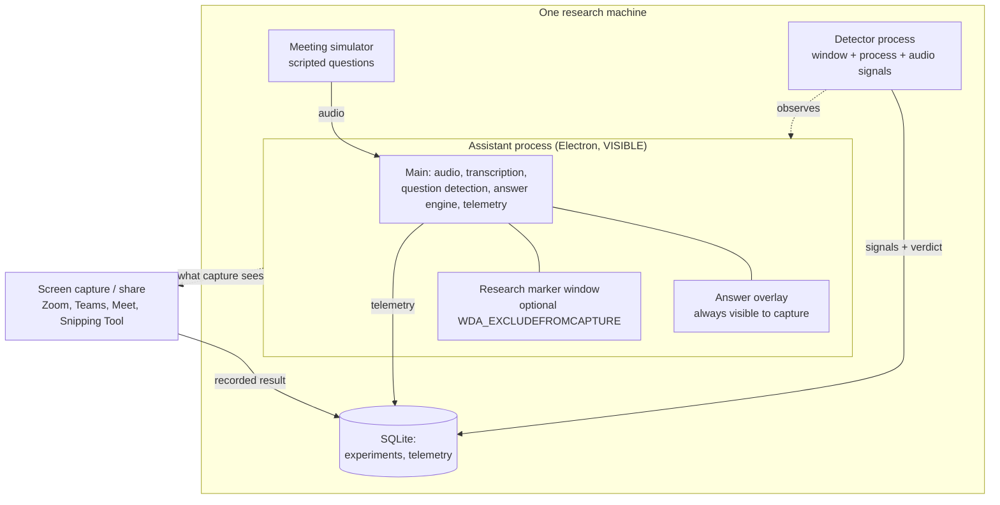
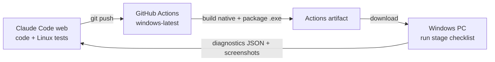

# Implementation Roadmap — Assistant Detection Study

## Purpose

This project supports a research paper on **how real-time "interview assistant" tools
work and how to detect them**. It builds, in one controlled test environment on the
researcher's own machines:

1. A **visible** real-time assistant (mic + application-audio capture, VAD, transcription, question detection, streamed answers, latency measurement) — so every layer of how these tools work is understood and documented.
2. A **research marker window** that can request Windows' documented capture-exclusion API, used as a detection target.
3. A **detector** (separate process) that tries to identify a running assistant from legitimate local signals.
4. A **test bench** (meeting simulator) so every experiment is reproducible.
5. An **experiment record** and evaluation so results are measured, not asserted.

## Scope boundary (read before building)

This is a **defensive / detection** study. Two things follow from that and are fixed:

- **The live-answer assistant overlay is never capture-excluded.** The assistant window
  is always visible to screen capture. The capture-exclusion API
  (`SetWindowDisplayAffinity` / `WDA_EXCLUDEFROMCAPTURE`) is applied only to a dedicated
  **research marker window** that carries no answer content. See
  [Why the marker window](#why-the-marker-window-and-not-the-answer-overlay) — it costs
  the study no data, because a local detector is indifferent to which window holds the
  answers.
- **No evasion or anti-detection work, ever.** Not in any phase: no process-name
  spoofing, no process / Task Manager hiding, no injection into meeting apps, no
  bypassing security, anti-cheat or proctoring software, no undocumented or kernel
  techniques, and nothing built specifically to defeat the detector. The detector is
  meant to win; the experiment measures whether it does.

The research questions are detection questions:

1. Does `WDA_EXCLUDEFROMCAPTURE` change what different capture mechanisms record?
2. Can a separate local detector still identify the assistant when capture exclusion is active?
3. Which observable local signals are useful for detection?
4. How much latency does the assistant pipeline introduce?
5. How reliable is detection across Windows versions and capture methods?

## Why the marker window, and not the answer overlay

The detector runs **locally**. `WDA_EXCLUDEFROMCAPTURE` only changes what a **remote
screen-share or recording** captures; it does nothing to hide a window from another
process on the same machine enumerating the window manager. So every detection signal is
observable without putting answers in the excluded window:

| Signal | How the detector reads it | Needs answers in the excluded window? |
|---|---|---|
| Display-affinity / capture-exclusion state | `GetWindowDisplayAffinity` on each top-level window | No |
| Process information | process list, module list | No |
| Window properties (size, class, owner) | window enumeration | No |
| Always-on-top | `GetWindowLong` ex-styles | No |
| Transparency / layered | ex-styles + `GetLayeredWindowAttributes` | No |
| Audio capture / application-loopback activity | audio session enumeration | No |
| Question → answer timing | correlates the assistant's own audio-in and answer-generation events (process / telemetry level) | No — observed on the visible assistant |

Merging the answer pipeline into the capture-excluded window would add a single binary
that both generates live answers and hides from the interviewer — the deployable misuse
artifact — while contributing **zero** additional detector data. So the marker window
carries the capture-exclusion toggle, the assistant stays visible, and the detector is
exercised against both.

---

## Architecture

Assistant and detector are **separate processes** and stay that way. They communicate
only indirectly, through the OS (the detector observes) and the shared experiment
database (both write results).

### Native components

| Component | Form | Reason |
|---|---|---|
| Display affinity (marker window) + window/affinity readback (detector) | N-API addon (`node-addon-api` + `cmake-js`), called from each process's main | Synchronous Win32 calls on an HWND the process owns; `GetWindowDisplayAffinity`, `GetWindowLong`, enumeration. |
| Audio capture (mic + application loopback) | Separate C++ helper process (`native/windows-audio` → `audio-helper.exe`) streaming framed PCM to main | A crash on an audio thread cannot take down Electron; no Electron ABI rebuild; testable standalone writing WAV. |

Wire format between helper and main: `[streamId u8 | sampleRate u32 | channels u8 | qpcTimestamp u64 | frameCount u32][PCM]`, versioned from day one.

## Development and testing workflow

All development happens in Claude Code on the web (Linux container). Nothing is built on
the Windows PC; it only **runs** CI-produced builds and reports results.

| Verified in the cloud (Linux) | Verified by GitHub Actions (Windows) | Needs the Windows PC |
|---|---|---|
| Monorepo, TypeScript, lint, unit tests | Native C++ compiles, native unit tests | Overlay/marker behavior, always-on-top, shortcuts |
| Electron shell under `xvfb` (smoke) | Packaged `.exe` builds and starts | `SetWindowDisplayAffinity` results vs. real capture |
| Pure-TS packages (VAD, router, question detector, conversation, answer engine with mocked AI) | | WASAPI mic + loopback on real devices |
| Detector signal logic against recorded fixtures | | Detector vs. live assistant + marker; latency, CPU, RAM |

Built in Stage 0: the Windows `.exe` artifact workflow, `docs/testing/stage-N.md`
checklists, an **Export Diagnostics** menu item (OS build, versions, devices, errors,
latency — never API keys), and encrypted API-key storage (`safeStorage`, Windows DPAPI;
the renderer never sees keys).

## AI providers (free-first, swappable)

Transcription and answers go through provider interfaces (`TranscriptionProvider`,
`LlmProvider`); the vendor is a setting.

| Role | Default (free) | Paid, low-cost real-time | Other |
|---|---|---|---|
| Speech-to-text | Groq `whisper-large-v3-turbo`, one VAD segment at a time | AssemblyAI Universal-Streaming or Deepgram Nova-3; OpenAI `gpt-live-transcribe` | Local `whisper.cpp`; Gemini Live |
| Answer LLM | Google Gemini Flash, streaming | `gpt-oss-120b` on Groq / Cerebras; Gemini Flash paid; GPT-5 mini (minimal reasoning) | Local Ollama |

Free tiers may train on prompts — test with simulator data, never real personal
information. Quotas change; check each console when creating a key.

---

## Stage 0 — Foundation
Project foundation and desktop shell, security baseline, CI + Windows build, Settings
(encrypted keys), diagnostics export. **Covers original Phases 0, 1 and the security /
error baseline.**

- npm workspaces: `apps/{assistant,detector,simulator}`, `packages/{shared,audio,transcription,conversation,ui,detection}`, `native/windows-audio`, `native/win-affinity`, `tests`, `docs`, `scripts`
- Electron + Vite + React + TypeScript (strict) + Tailwind; ESLint, Prettier, Vitest
- Security baseline: `contextIsolation`, `nodeIntegration:false`, `sandbox:true`, strict CSP, typed IPC with zod validation on every channel, structured logging with secret redaction, a user-facing `AppError`
- CI (Linux + Windows), portable `.exe` artifact, Export Diagnostics, Settings screen, `docs/testing/stage-0.md`

**Gate:** downloaded `.exe` starts on the PC and its diagnostics export is pasted back; renderer cannot reach Node (`window.require`/`process` undefined); IPC round-trip test passes; typecheck, lint, test, build all green in CI.

## Stage 1 — Audio capture
Native Windows capture of microphone and application/system audio as two separate,
timestamped channels. **Original Phases 4, 5.** Diagnostics screen (sample rate,
channels, frame size, RMS, peak, dropped frames, buffer latency) and A/B level meters.

**Gate (Windows):** a clip played through speakers appears on channel B only; mic speech on channel A only; ~0 dropped frames over 10 min.

## Stage 2 — Speech pipeline
VAD, live transcription behind `TranscriptionProvider`, and channel-based speaker
labelling (USER / INTERVIEWER / UNKNOWN). **Original Phases 6, 7, 8.** Timestamps and a
SQLite store (`sessions`, `transcripts`, `latency_events`, `errors`) land here so timing
exists from the first frame.

**Gate:** provider tested against a mock server (Linux); transcripts of test clips match expected text closely; on Windows both streams transcribe live with correct routing.

## Stage 3 — Assistant (visible)
Question detection, conversation memory with an explicit `CandidateProfile`, and a
streamed answer engine shown in an **always-visible** overlay with a per-stage latency
readout. **Original Phases 9, 10, 11, 12, 13.**

**Gate:** question-detector precision/recall on labelled transcripts; answer-engine tests (streaming, cancellation, word limit) with a mocked model; on Windows, spoken question → streamed answer with latency shown.

## Stage 4 — Test bench
Meeting simulator that plays the scripted interviewer questions in a fake meeting window,
for repeatable runs. **Original Phase 15.** Sessions recorded to SQLite.

**Gate:** one command runs a scripted session end to end and records it.

## Stage 5 — Detector (separate process)
A standalone detector that enumerates windows and processes and reads the signals in the
[table above](#why-the-marker-window-and-not-the-answer-overlay): capture-exclusion /
display-affinity state, process info, window properties, always-on-top, transparency,
audio-capture / application-loopback activity, and the question→answer timing
relationship. It emits a verdict with the signals that fired. **New; realises the study's
detection goal. Original Phase 14's capture tests fold in here.**

**Gate:** detector unit tests over recorded signal fixtures (Linux); on Windows it identifies the running assistant and reports which signals fired.

## Stage 6 — Research modes, experiments, evaluation
- **Research Settings panel** with two explicit modes (never auto-enabled):
  - **Normal research mode:** no window capture-excluded; assistant visible; detector active; all telemetry recorded.
  - **Capture-exclusion research mode:** the **marker window** requests `WDA_EXCLUDEFROMCAPTURE`; the assistant overlay stays visible to the local user; detector active; the screen-capture result and the detector result are both recorded.
- **Experiment record** (SQLite + CSV/JSON export): `experiment_id`, `timestamp`, Windows version, assistant mode, display-affinity mode, simulator state, detector state, capture method, whether the assistant/marker appeared in capture, whether the detector identified it, detection signals, false-positive / false-negative classification, latency metrics.
- **Evaluation scripts:** detector true/false positive and negative rates across Windows versions and capture methods; latency; optionally a comparison run against commercially available tools the researcher installs themselves. **Original Phases 16, 17.**

**Gate:** a scripted experiment in each mode produces a complete experiment record and export; evaluation scripts run on it; results recorded as measured.

## Stage 7 — Hardening & paper material
Fault injection for every failure path (no mic, permission denied, no loopback, API down,
network / socket drop, malformed audio, timeouts, native crash, unsupported Windows),
each with a clear UI error; security audit against the Stage 0 baseline; `docs/` with
Mermaid diagrams; `research/` methodology, metrics, limitations. **Original Phases 18, 19,
20, 21.**

**Gate:** fault tests pass; no secrets in logs or the renderer bundle; docs and research write-ups complete; a release `.exe` published from CI.

---

## Working rules per phase

1. Inspect the repo, then state a short plan.
2. Build the smallest complete increment.
3. Run typecheck, lint, unit tests, build. Fix failures; never report "should work".
4. State exactly what could not be tested here (usually Windows/device items) and what to verify manually.
5. Update docs, commit, push, stop at the gate.

## Next step

Finish **Stage 0**, then show the updated architecture and the exact Stage 1 plan.
