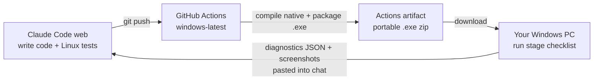

# Implementation Roadmap — Realtime Interview Assistant

This roadmap builds the **application first**. The research work from the original brief
(Capture Laboratory, experiment data collection, evaluation scripts, research-paper
material) is **parked** until the app is finished and judged worth writing up. See
[Parked for later](#parked-for-later).

The build is split into **6 stages**. Each stage ends with a **gate**: a short list of
things that must actually be shown to work before the next stage starts. The original
phase numbers are kept so the brief and this plan can be cross-referenced.

## Changes from the brief's ordering

| Change | Why |
|---|---|
| **Research phases 14, 16, 17, 21 are parked** | Build and prove the product first; research only if it is worth it. |
| **Security (19)** and the **error surface (18)** start in Stage 0 as baseline rules | Context isolation, typed IPC, keeping secrets out of the renderer, and visible errors are much cheaper to build in from the start than to add later. Stage 5 is then an audit, not a rewrite. |
| **Latency timestamps and a small SQLite store move into Stage 2** | The latency readout (Phase 12) is a product feature, and it only works if timestamps exist from the first audio frame. Adding them after the pipeline is built means touching every module again. |
| **Test audio clips from the Test Meeting Simulator (15) move into Stage 2** | Loopback capture, VAD and transcription each need repeatable, known audio to test against. The full simulator comes in Stage 4 as a development test tool. |
| **Microphone and loopback both use native WASAPI** (not `getUserMedia` for the mic) | Both streams then share one clock (`QueryPerformanceCounter`), which keeps turn ordering (Phase 8) and latency numbers correct. |
| **Capture exclusion (3) starts with Electron's `setContentProtection`** before writing a native addon | On Windows 10 2004+ Electron already calls `SetWindowDisplayAffinity(WDA_EXCLUDEFROMCAPTURE)`. The native addon is then only needed for what Electron does not expose: reading back the current affinity with `GetWindowDisplayAffinity`, `GetLastError`, and the OS build number. |

## Native architecture decision

| Component | Form | Reason |
|---|---|---|
| Display affinity (Phase 3) | Small N-API addon (`node-addon-api` + `cmake-js`), called from Electron **main** | Synchronous calls on an HWND that main already owns. |
| Audio capture (Phases 4–5) | Separate C++ helper process (`native/windows-audio` → `audio-helper.exe`) streaming framed PCM to main over a named pipe or stdout | A crash on an audio thread cannot take down Electron. There is no Electron ABI rebuild for the audio code. It can be tested on its own with a CLI that writes WAV files. |

Wire format between the helper and main: `[header: streamId u8 | sampleRate u32 | channels u8 | qpcTimestamp u64 | frameCount u32][PCM payload]`, versioned from day one.

## Development and testing workflow

All development happens in Claude Code on the web (a Linux cloud container). Nothing is
built on the Windows PC; it is only used to **run** builds and report results.

| Verified in the cloud (Linux) | Verified by GitHub Actions (Windows runner) | Needs your Windows PC |
|---|---|---|
| Monorepo, TypeScript, lint, unit tests | Native C++ compiles, native unit tests | Overlay behavior (always-on-top, shortcuts, drag) |
| Electron shell launch under `xvfb` (smoke test) | Packaged `.exe` builds and starts | `SetWindowDisplayAffinity` results |
| All pure-TS packages (resampler, VAD, router, question detector, conversation manager, answer engine with mocked AI) | | WASAPI mic and loopback against real devices |
| | | Real end-to-end latency, CPU and RAM |

Supporting pieces, all built in Stage 0:

- **Windows build workflow:** every push builds a portable `.exe` with `electron-builder` and uploads it as an Actions artifact.
- **Test checklists:** `docs/testing/stage-N.md` lists exactly what to click and what to look for at each gate.
- **Export Diagnostics:** a menu item that saves a JSON file with OS build, app version, device list, API results, errors and latency. API keys are never included. You paste it into chat.
- **API keys in the packaged app:** a `.env` file is not shipped. Keys are entered on a Settings screen and stored encrypted by Electron main (`safeStorage`, which uses Windows DPAPI). The renderer never sees them.

CI runners have no audio devices, so device tests are done manually on your PC and their
results are noted in `docs/testing/results/`.

## AI providers (free-first, swappable)

Transcription and answer generation go through provider interfaces
(`TranscriptionProvider`, `LlmProvider`), so the vendor is a setting, not a rewrite.

| Role | Default (free tier) | Paid, low-cost real-time | Other alternatives |
|---|---|---|---|
| Speech-to-text | Groq `whisper-large-v3-turbo`, sent one VAD speech segment at a time | AssemblyAI Universal-Streaming or Deepgram Nova-3 (streaming WebSocket); OpenAI `gpt-live-transcribe` | Local `whisper.cpp` (offline); Gemini Live |
| Answer LLM | Google Gemini Flash, streaming | `gpt-oss-120b` on Groq or Cerebras (fastest); Gemini Flash paid tier; GPT-5 mini with minimal reasoning | Local Ollama |

Trade-off: Whisper on Groq is not a streaming API. You get one final transcript per
speech segment instead of word-by-word deltas. Because the pipeline already cuts audio
into segments with VAD (Phase 6), this costs roughly the time of one HTTP round trip per
segment. Phase 7's streaming-delta path is kept for providers that support it.

Free-tier quotas and terms change. Check each provider's console when the key is created.
Free tiers may use prompts to improve the provider's models, so test with simulator data,
not real personal information.

---

## Stage 0 — Foundation & desktop shell
**Phases: 0, 1 (+ baselines of 18, 19)**

- npm workspaces monorepo: `apps/desktop/{electron,preload,renderer}`, `apps/server`, `packages/{shared,audio,realtime,conversation,ui}`, `native/windows-audio`, `tests`, `docs`, `scripts`
- Electron + Vite + React + TypeScript (strict) + Tailwind; ESLint, Prettier, Vitest
- Secure baseline: `contextIsolation: true`, `nodeIntegration: false`, `sandbox: true`, a strict CSP, and a typed IPC contract in `packages/shared` with runtime validation (zod) on every channel
- Structured logger with secret redaction; an `AppError` type shown in the UI
- `.env.example`, `.gitignore` (including `.env`), `README.md`, `CLAUDE.md`
- Scripts: `dev`, `build`, `test`, `lint`, `typecheck`, `package`
- Status UI showing mic, system audio and AI as "not connected", plus placeholder transcript, question, answer and latency panels
- CI workflow (Linux + Windows) and the Windows portable-`.exe` artifact build
- Export Diagnostics menu item; `docs/testing/stage-0.md` checklist; Settings screen with encrypted API-key storage

**Gate:** the downloaded `.exe` starts on your PC and its diagnostics export is pasted back; a test proves `window.require`/`process` are undefined in the renderer; an IPC round-trip test passes; typecheck, lint, test and build are all green in CI.

## Stage 1 — Assistant overlay window
**Phases: 2, 3**

- `AssistantWindowManager`: frameless, transparent-capable, always-on-top, draggable, resizable, opacity, compact mode, global show/hide shortcut, position persisted per display. Fed by fake data only.
- Capture exclusion setting: `setContentProtection` first, then the N-API addon `setDisplayAffinity(hwnd, NONE | EXCLUDEFROMCAPTURE)` plus readback.
- Small status line in Settings: OS build, API result, `GetLastError`, current affinity.
- `docs/windows-capture.md`, including the limitation: Windows does not guarantee exclusion from every capture method.

**Gate (Windows):** the overlay behaves as specified with fake data; the affinity goes NONE → EXCLUDE → NONE and the readback confirms each step.

## Stage 2 — Audio engine
**Phases: 4, 5, 6 (+ latency timestamps from 12, + test audio clips from 15)**

1. **Timestamps and storage first:** `packages/shared` defines `TimingEvent`; SQLite (`better-sqlite3`, in main) has `sessions`, `latency_events` and `errors` tables plus a migration runner.
2. **Test audio clips:** a set of WAV files (the four sample interviewer questions, silence, noise, overlapping speech) with expected transcripts and timestamps in `tests/fixtures/audio/`.
3. **Phase 4 – mic:** WASAPI capture in `audio-helper.exe`; an `AudioSource` interface in TS (`start/stop/pause/resume/getDevices/setDevice/onAudioFrame`); an audio diagnostics screen showing sample rate, channels, frame size, RMS, peak, dropped frames and buffer latency.
4. **Phase 5 – loopback:** process loopback through `ActivateAudioInterfaceAsync` (process plus child processes), falling back to system loopback; streams tagged `MICROPHONE_AUDIO`, `SYSTEM_AUDIO` or `APPLICATION_AUDIO`; two-channel A/B meters; `docs/audio-pipeline.md` covering the full chain from the Windows Audio Engine through IAudioClient to the transcription provider.
5. **Phase 6 – processing (pure TS, fully unit-tested):** resample, downmix, PCM16, normalize, energy VAD with configurable thresholds, and segmenting into `AudioFrame`, `SpeechSegment`, `AudioStream` and `Turn`.

**Gate:** VAD and segmentation unit tests pass against the test clips (Linux). On Windows: a clip played through the speakers appears on channel B only; speech into the mic appears on channel A only; dropped frames are about 0 over 10 minutes.

## Stage 3 — Speech pipeline
**Phases: 7, 8**

- At the start of this stage, check the current docs for the chosen provider (model IDs, event names, quotas) rather than trusting older notes.
- `TranscriptionProvider` interface with a segment-based Groq Whisper implementation first (free); a streaming implementation (AssemblyAI, Deepgram or OpenAI) behind the same interface.
- `RealtimeTranscriptionClient` (streaming providers) runs in main/server only (`connect`, `disconnect`, `sendAudio`, `commitTurn`, `onTranscriptDelta`, `onTranscriptFinal`, `onError`) over WebSocket, with reconnect and backoff.
- Two independent sessions: USER (mic) and INTERVIEWER (loopback). Partial and final transcripts with timestamps, source and latency.
- `ConversationRouter`: source channel → USER, INTERVIEWER or UNKNOWN, ordered by QPC timestamp; UNKNOWN when confidence is low (for example, both channels speaking at once).

**Gate:** the client passes tests against a mock server (Linux); an integration test checks that transcripts of the test clips match the expected text closely. On Windows: both transcripts stream live and the routing is correct.

## Stage 4 — Intelligence & finished UI
**Phases: 9, 10, 11, 12, 13, 15**

- **9 `QuestionDetector`:** punctuation, interrogative and imperative patterns, pause length after the utterance, and conversation state; an optional LLM classifier only for ambiguous cases. Emits a `QuestionEvent` (`id`, `text`, `startTime`, `endTime`, `confidence`). It does not fire on fragments.
- **10 `ConversationManager`:** turns, questions and answers; recent and session context; a `CandidateProfile` that the user enters explicitly. Nothing is inferred or invented. Session history (transcripts, questions, answers) is saved in SQLite.
- **11 `AnswerEngine`** over an `LlmProvider` interface (Gemini Flash by default): streaming, first person, 60–100 words by default, configurable length, tone and detail; the prompt is grounded only in the profile and the transcript.
- **12 Latency:** a `TOTAL LATENCY` readout plus a per-stage breakdown (capture → VAD → transcription → question detection → first answer token → UI). Optimize only where the numbers show the time goes.
- **13 Final overlay:** question, streaming answer, key points, status (Listening / Processing / Answer ready), latency, and a **Debug panel** toggle for transcript and question confidence, audio source and token timing.
- **15 Test Meeting Simulator:** a small local app that plays the scripted interviewer questions with a fake meeting window, so the whole pipeline can be tested the same way every time without a real call.

**Gate:** question-detector unit tests pass on a set of labeled sample transcripts; answer-engine tests with a mocked model cover streaming, cancellation and the word limit; on Windows, a simulator run goes from spoken question to streamed answer in the overlay with the latency readout shown.

## Stage 5 — Hardening & release
**Phases: 18, 19, 20**

- **18:** a fault-injection test for every failure listed in the brief (no mic, permission denied, no loopback, API down, network drop, WebSocket drop, malformed audio, timeouts, native helper crash, unsupported Windows build). Each one shows a clear UI error.
- **19:** security audit against the Stage 0 baseline (IPC surface, CSP, secret handling, logs, dependency audit).
- **20:** `docs/` set with Mermaid diagrams: architecture, audio pipeline, transcription pipeline, Windows capture, latency, troubleshooting.

**Gate:** all fault-injection tests pass; there are no secrets in logs or the renderer bundle; the docs are complete; a release `.exe` is published from CI.

---

## Parked for later

These phases are not built now. They are picked up only if the finished app is worth a
research write-up.

| Phase | What it was | Why parking it costs little |
|---|---|---|
| **14** Capture Laboratory | Systematic tests of which capture methods include or exclude the overlay | The capture-exclusion setting and its readback already exist from Stage 1. |
| **16** Research data collection | Experiment tables, `experiment_id`, CSV/JSON export | Sessions, latency events, transcripts, questions and answers are already stored in SQLite from Stages 2–4. Adding exports is a small change. |
| **17** Evaluation | Scripts for WER, question-detection accuracy, answer relevance, hallucination rate, CPU/RAM | The Test Meeting Simulator and test clips from Stage 4 are the inputs these scripts would use. |
| **21** Research paper material | Methodology, experiment design, metrics, prompting comparisons | Needs only documentation once the data above exists. |

## Working rules per phase

1. Inspect the repo, then state a short plan.
2. Build the smallest complete increment.
3. Run typecheck, lint, unit tests and build. Fix failures; never report "should work".
4. State exactly what could not be tested here (usually Windows/device-specific items) and what to verify manually.
5. Update the docs, commit, push, and stop at the gate.

## Next step

**Stage 0** (Phases 0 + 1). Stop after the Electron shell launches and the gate checks pass.
